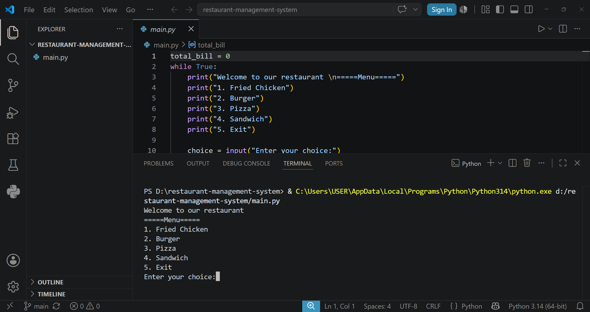

# Restaurant Management System

A simple command-line Restaurant Management System built with Python. The application allows users to browse a menu, place multiple orders, and automatically calculate the total bill.

---

## Overview

This project was developed to practice Python fundamentals, including loops, conditional statements, user input handling, and basic billing logic.

---

## Features

- Interactive menu-driven interface
- Multiple item ordering
- Automatic bill calculation
- Continuous ordering until exit
- Simple command-line interface

---

## Technologies Used

- Python 3
- Visual Studio Code
- Git
- GitHub

---

## Project Structure

```text
restaurant-management-system/
│
├── main.py
├── project_screenshot.png
└── README.md
```

---

## Installation

Clone the repository:

```bash
git clone https://github.com/nabilaalam05-jpg/restaurant-management-system.git
```

Navigate to the project directory:

```bash
cd restaurant-management-system
```

Run the application:

```bash
python main.py
```

---

## Screenshot



---

## Learning Outcomes

This project helped me strengthen my understanding of:

- Python fundamentals
- Loops and conditional statements
- User input handling
- Basic billing logic
- Git and GitHub workflow

---

## Future Improvements

- Quantity selection
- Order history
- Customer information
- Inventory management
- Database integration
- Graphical User Interface (GUI)

---

## Author

**Nabila Alam**

GitHub: https://github.com/nabilaalam

---

## License

This project is licensed under the MIT License.
